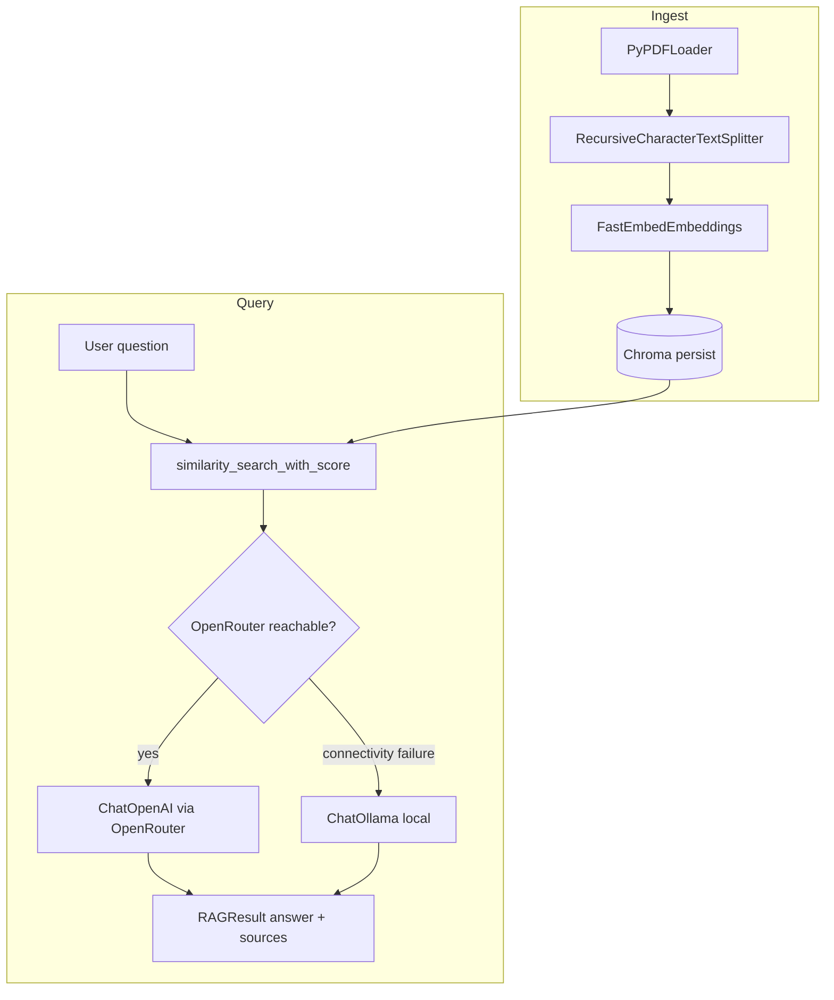

# rag-app

Retrieval-augmented generation over PDFs: build a local vector index, retrieve scored chunks, and answer with **OpenRouter** (OpenAI-compatible API) or **Ollama** on connectivity failures. Answers include **cited sources** (file, page, excerpt, distance).

---

## Features

- PDF ingestion with page-aware metadata  
- Chunking, top‑k retrieval, and persistent **Chroma** storage under the project  
- Local **FastEmbed** embeddings (no embedding API key)  
- **OpenRouter** chat with **Ollama** fallback on transport errors only  
- **Streamlit** UI: index build, Q&A, expandable sources  

---

## Tech stack

### Language


### Frameworks, platforms & libraries


### Vector store & embeddings


### AI & inference


---

## Architecture



---

## Prerequisites

- **[uv](https://docs.astral.sh/uv/)** and **Python 3.13** (see `.python-version`)  
- **OpenRouter API key** if you want cloud chat (optional; omit for Ollama-only)  
- **Ollama** with your model pulled if you use local fallback or no API key  

---

## Getting started

```powershell
# 1) Go to your clone of this repository (use your own path)
cd <path-to-repo>

# 2) Install dependencies into .venv and install this project (editable)
uv sync

# 3) Create local env from the template (Windows)
copy .env.example .env
# Then edit .env and set OPENROUTER_API_KEY if you use OpenRouter.

# 4) Start the UI (uses .venv automatically)
uv run rag-ui
```

```powershell
# Optional: activate the venv first, then use the console script
cd <path-to-repo>
.\.venv\Scripts\Activate.ps1
rag-ui
```

```powershell
# Optional: run Streamlit on another port
cd <path-to-repo>
uv run rag-ui -- --server.port 8502
```

Open the URL Streamlit prints (default **http://localhost:8501**). After changing `.env`, use **Re-check LLM** in the sidebar or restart the app.

The repo includes `.streamlit/config.toml` and `.streamlit/credentials.toml` so the first-run email prompt does not block non-interactive starts.

---

## `.env` options

Copy `.env.example` to `.env` and set **`OPENROUTER_API_KEY`** when using OpenRouter. Everything else is optional; defaults are in `src/rag/config.py`.

| Variable | Purpose |
|----------|---------|
| `OPENROUTER_API_KEY` | Bearer token for OpenRouter. Empty → Ollama-only. |
| `OPENROUTER_MODEL` | Chat model id (default `openrouter/free`). |
| `OPENROUTER_REASONING_ENABLED` | `true` / `1` / `yes` → send OpenRouter `reasoning` extra body. |
| `OLLAMA_MODEL` | Local chat model name. |
| `CHROMA_PERSIST_DIR` | Vector index directory (relative paths resolve under repo root). |
| `OPENROUTER_BASE_URL` | API base URL override. |
| `OPENROUTER_HTTP_REFERER` | Optional `HTTP-Referer` header (OpenRouter attribution; not a callback URL). |
| `OPENROUTER_APP_TITLE` | Optional `X-Title` header for OpenRouter. |
| `OLLAMA_BASE_URL` | Ollama server URL. |
| `LLM_REQUEST_TIMEOUT` | OpenRouter probe / request timeout (seconds). |
| `CHUNK_SIZE` / `CHUNK_OVERLAP` | Text splitter settings. |
| `TOP_K` | Retrieved chunks per question. |
| `FASTEMBED_MODEL` | FastEmbed model id. |
| `EXCERPT_MAX_CHARS` | Max length of excerpt shown per source. |

---

## Project layout

```text
.
├── .env.example
├── .gitignore
├── .python-version
├── .streamlit/
│   ├── config.toml
│   └── credentials.toml
├── pyproject.toml
├── streamlit_app.py
├── uv.lock
└── src/
    └── rag/
        ├── __init__.py
        ├── chunking.py
        ├── cli.py
        ├── config.py
        ├── embeddings.py
        ├── llm.py
        ├── loaders.py
        ├── rag.py
        └── vectorstore.py
```

---

## Development

- Library code lives under **`src/rag/`**; the Streamlit entrypoint is **`streamlit_app.py`**.  
- Console script **`rag-ui`** is defined in `pyproject.toml` and points at `rag.cli:main`.  
- Distributable packages: run **`uv build`** → artifacts under **`dist/`** (and possibly **`build/`**); the live index is stored under **`chroma_db/`** (or `CHROMA_PERSIST_DIR`), not in `dist/`.
